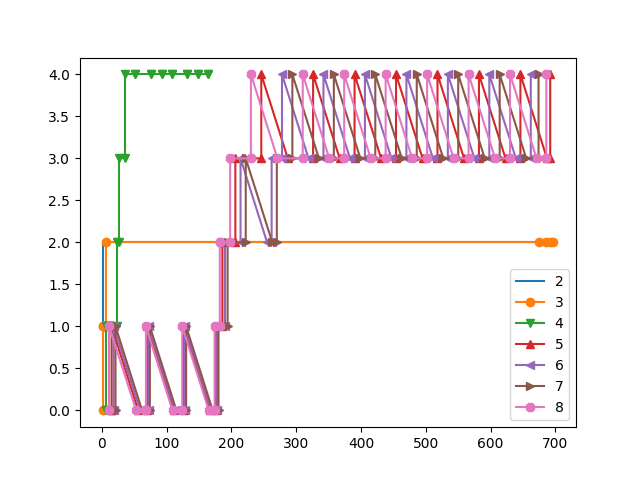

# Assignment 5: Enhancing xv6 OS

## Task 1

### waitx
`int waitx(int *wtime, int *rtime);`

This syscall stores the time for which a process was waiting and for which the process was running. The return value is `0` if everything goes as expected else it is `-1`.

`ctime` was assigned when the process was created
`rtime` was incremented at every tick for the process.
`etime` was assigned when the process exited
`wtime = etime - ctime - rtime`, basically, whenever it wasn't running in it's lifetime, it was waiting.

Using the `waitx` syscall, I have implemented a `time` command which works like the unix `time` command.

```sh
Usage:
time commands [args]
```

---

### getpinfo
`int getpinfo(struct proc_stat *);`

```
struct proc_stat { 
    int pid;
    int runtime;
    int num_run;
    int current_queue;
    int ticks[5];
```

Some parameters like current\_queue, and ticks have a value of -1 when they are not valid in that particular scheduling algorithm.

---

### set\_priority
`int set_priority(int priority);`

This syscall takes the new priority for a process and returns it's old priority.
This value is ignored when PBS isn't being used. If the new priority is not valid, the priority is not changed.

---

## Task 2
The default scheduler for xv6 is round robin. Our task was to implement some more scheduling algorithms.

### First come first serve (FCFS)
In this policy, the process with the lowest creation time is selected.

### Priority based scheduling (PBS)
In this policy, the process with the highest priority (lowest priority number) is selected.

### Multi level feedback queue (MLFQ)
This one is a bit complicated, so I am copy-pasting the assignment requirements.

#### Scheduler details
1. Create five priority queues, with the highest priority being number as 0 and 
 bottom queue with the lowest priority as 4. 
2. Assign a suitable value for 1 tick of CPU timer.
3. The time-slice for priority 0 should be 1 timer tick. The times-slice for priority 1 is 2 timer ticks; for priority 2, it is 4 timer ticks; for priority 3, it is 8 timer ticks; 

 
#### Procedure
1. On the initiation of a process, push it to the end of the highest priority queue. 
2. The highest priority queue should be run always, if not empty. 
3. If the process completes, it leaves the system. 
4. If the process used the complete time slice assigned for its current priority 
queue, it is pre-empted and ​inserted at the end of the next lower level queue. 
5. If a process voluntarily relinquishes control of the CPU, it leaves the queuing 
network, and when the process becomes ready again after the I/O, it is 
inserted at the tail of the same queue, from which it is relinquished earlier 
(Explain in the report how could this be exploited by a process ?). 
6. A round-robin scheduler should be used for processes at the lowest priority 
queue. 
7. To prevent starvation, implement the aging phenomenon using the structure 
defined in Task 1
   - If the wait time of a process in lower priority queues exceeds a given 
  limit(assign a suitable limit to prevent starvation), their priority is 
  increased and they are pushed to the next higher priority queue. 
   - The wait time is defined as the difference between the current time and 
  the time at which the process was last executed. 

## Comparison
The same set of processes were ran under different scheduling schemes.
This set comprised of both io and cpu bound processes.

For testing, use the command `test_sched`.
To run only one long time taking program, you can use `long_wait`.

|        |rtime |wtime |
| --     | --   | --   |
| `RR`   | 1447 | 2203 |
| `FCFS` | 1475 | 1179 |
| `PBS`  | 1395 | 1736 |
| `MLFQ` | 692  | 2672 |

As it can clearly be seen from this table, FCFS offers the lowest runtime, since it is preemption free, but also, it has the highest runtime. This means that the cpu spent very less time deciding which process to take up next and let the process do it's own job.

On the other extreme, consider MLFQ, which has the highest wtime and lowest rtime. This means that the cpu spent a considerable amount of time deciding which process to schedule next, managing queues, aging and demoting processes, etc.

## Bonus
The graph was plot using python



Process 2 is hidden behind the line of process 3.
2: sh
3: parent of all forks [was sleeping all the time]
